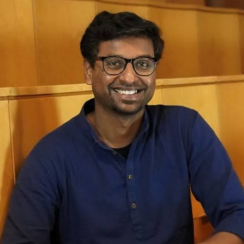

<!-- # HCI-TERRA: HCI Towards EnviRonmentally Responsible AI -->

## What is this workshop about?

The rapid adoption of AI has come with a significant environmental burden due to increased resource usage, yet such material and environmental impacts of AI are no surprise anymore. Following a successful workshop at FAccT'25, this CHI'26 workshop will consolidate ideas and create a grand challenges and opportunities map of this emerging topic of interest in HCI. 

The goal is to lay solid foundations of building a community of HCI researchers interested in mitigating the environmental impact of AI and accordingly bring methods from our inherently interdisciplinary domain that go beyond solutionist narratives. Topics include but are not limited to how we can support communities impacted by data centers, how we can engage with humor, participatory methods and speculative design futures to build awareness and how to best support the design of eco-feedback tools among others. 

We hope to build a persistent hybrid research area among sustainable HCI and AI. Towards that goal, the planned output of this workshop is a synthesis grand challenges article or manifesto as well a series of follow-up community-building activities such as initiating a mailing-list, reading group and/or Discord channel.

### HCI Challenges and Opportunities to support AI Environmental Sustainability

We have identified five directions of how HCI can support AI environmental sustainability synthesising literature and personal experiences of working in this domain. These are:
- Supporting communities with resistance on the ground
- Participatory approaches for building awareness
- Tools for Eco-feedback
- Understanding and promoting sufficiency
- The impact of HCI research itself

Yet this workshop aims to collectively generate additional opportunities and challenges that go beyond our existing understanding. We will thus ensure that there is space for the participants to shape the workshop discussions and outputs based on their own interests and expertise and encourage participants to send in their perspectives.

See also the [full workshop proposal](assets/css/CHI26_Workshop_HCI-TERRA.pdf){:target="_blank"}.

## Call for Participation
Participation is open to all seasoned scholars and early career researchers. We solicit descriptions of completed projects, works-in-progress, and provocations of up to 4-pages (less are welcome) in the ACM CHI submission format. References do not count for the total page count. 

<!-- Please submit your papers through **this [form](https://forms.cloud.microsoft/e/hWTJs1FfYz){:target="_blank"} by 10th February (AOE)**. -->
**Please submit your papers by emailing the lead organiser georgia.panagiotidou@kcl.ac.uk, by ~~14th~~ 23th February (AOE)**.

The submissions will be reviewed by the workshop organizers and all accepted papers that opt-in will be published through this website and presented at the workshop. Note that according to CHI'26 this needs to be an in-person workshop and at least one author of each accepted submission must attend the workshop.

For any questions contact *georgia.panagiotidou@kcl.ac.uk*.

<!-- ## Format -->

<!-- #### How to take part?

In-person participants can register through the [FAccT'25 website](https://facctconference.org){:target="_blank"}.

## Time/Location
Online and at the [Athens Conservatoire](https://www.athensconservatoire.gr/){:target="_blank"},
 
Jun 24, 2025 @ 2:45pm - 5:15pm Athens, Greece (UTC +3) -->

## Organisers 

[**Georgia Panagiotidou**](https://fourcoffees.github.io/georgiapanagiotidou/){:target="_blank"}, King's College London.
 Georgia is an Assistant Professor at King's College London at the department of Informatics. Her work broadly centers around how people engage with environmental data exploring key challenges such as biases, uncertainties, and friction in collective data use. Georgia investigates the environmental impact of AI commencing from the tools and interfaces that developers, end-users and communities experience as probes. Leading this workshop and similar efforts at FAccT, she is building bridges between the domains of HCI, STS and sustainable AI.
 
 

**Silvia Cazacu**, KU Leuven  
Silvia is a PhD student at KU Leuven and a Marie Curie fellow in the Towards Sustainable Open Data Ecosystems project where she focused on the inclusiveness of participatory data practices. Her research applies a feminist lens to critically analyze the power dynamics that emerge between diverse stakeholders who collaborate on infrastructural decisions about data. She combines participatory methods with tangible thinking tools such as data physicalization and serious games to make complex issues visible and negotiable. 
 
 

**Christina Bremer**, University of Cambridge  
Christina is a Research Associate at the University of Cambridge. She is working on the Green Algorithms Initiative, a project that focuses on quantifying and reducing the environmental impacts of computational science. More generally, by applying an HCI lens and combining efficiency with sufficiency principles, her works aims to help limit the environmental impacts of computing technology and use computing to facilitate environmentally sustainable decision-making and behaviors.
 
 

**Sinem Görücü**, King's College London   
Sinem is a PhD student at King's College London researching the environmental sustainability of machine learning through a Human–Computer Interaction (HCI) lens. Her work examines how practitioners perceive and engage with sustainability in AI development, and explores participatory and tangible approaches to making environmental costs of computing visible and actionable. Her research spans sustainable HCI, data physicalization, and participatory design. 
 
 

**Nanna Inie**, IT University of Copenhagen  
Nanna is an Assistant Professor at the IT-University of Copenhagen, Denmark. Her research focuses on ethical, safe, and sustainable deployment of GenAI. She has extensive organization experience inside and outside of academia and has, among other events, founded and organized the largest TEDx event in Denmark. She did the CO2  accounting for GenAI in the CHI 2024 corpus, and has published on LLM security as "demon summoning", as well as on the effect of anthropomorphization of so-called AI systems on people's trust.
 
 

**Luiz A. Morais**, Universidade Federal de Pernambuco  
Luiz is an Assistant Professor at the Centro de Informática of the Universidade Federal de Pernambuco, in Brazil, and co-founder of the VIXE (Visualizações, Interfaces e eXperiências Emergentes) research group. His research bridges the fields of Human-Computer Interaction and Data Visualization, with a focus on sustainability and decoloniality. Morais critically examines how digital systems---especially artificial intelligence---affect the planet and society. His involvement in national and international workshops reflects a commitment to expanding the global debate from the margins, repositioning the Global South as a center of critical innovation.
 
 

**Ana Valdivia**, Oxford Internet Institute, University of Oxford  
Ana is a Departmental Research Lecturer in Artificial Intelligence (AI), Government, and Policy at the Oxford Internet Institute (University of Oxford). She investigates how datafication and algorithmic systems are transforming political, social, and ecological territories and communities. Her current research agenda focuses on the AI supply chains, by investigating trade-off between environmental costs and social benefits of AI, from mineral extraction to chip manufacturing, data centers, and electronic waste dumps across different geographies.
 
 

**Raghavendra Selvan**, IT University of Copenhagen  
Raghav is an Assistant Professor at the Machine Learning (ML) Section, Dept. of Computer Science, University of Copenhagen (UCPH). His research interests  broadly lie at the intersection of sustainability and ML where he is investigating sustainability with ML, and also the sustainability of ML. He is the author of the book “Sustainable AI” (2025).
 
 

**Ben Snaith**, King's College London  
Ben is a Visiting Researcher at King's College London researching data empowerment, environmental intelligences and internet infrastructures. His work looks to ground ecological and activist thinking within critical research on datafication and media infrastructures. 
